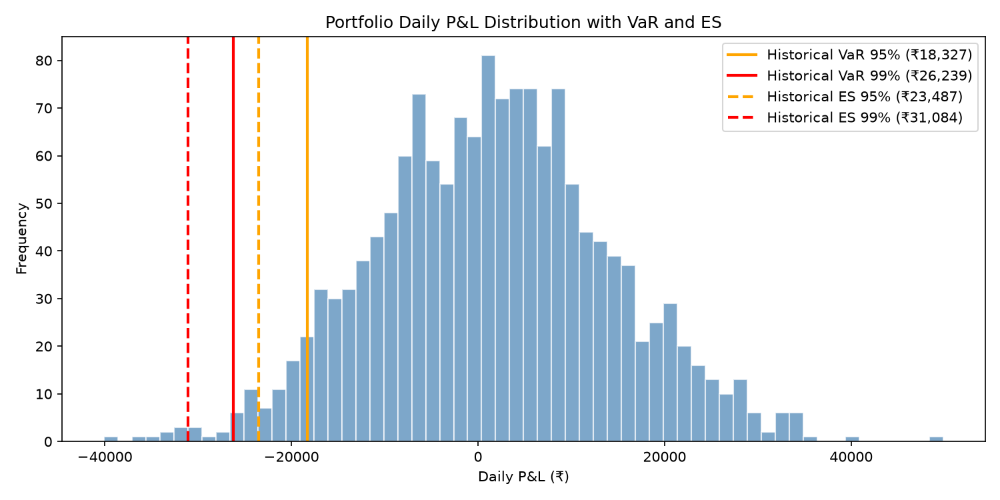
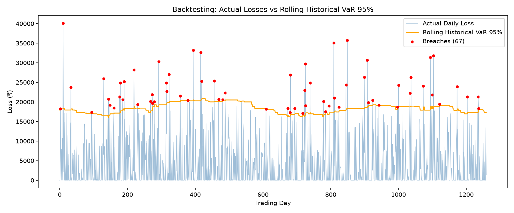

<div align="center">


</div>

---

## 📌 Overview

A Python implementation of market risk measurement on a **₹10,00,000 portfolio** calibrated to **Nifty 50 index statistics (2018–2024)**.

Implements and compares two industry-standard VaR methods, computes Expected Shortfall (CVaR), scales to a 10-day horizon using the Basel III square-root-of-time rule, and validates both models through rolling-window backtesting.

---

## ⚙️ Methods Implemented

| Method | Description |
|---|---|
| **Historical Simulation VaR** | Non-parametric — reads risk directly from empirical return distribution |
| **Parametric (Variance–Covariance) VaR** | Assumes normally distributed returns using z-score formula |
| **Expected Shortfall (CVaR)** | Average loss on days that breach VaR — captures tail risk beyond VaR |
| **10-Day VaR Scaling** | Basel III square-root-of-time rule: VaR₁₀ = VaR₁ × √10 |
| **Rolling Backtesting** | 252-day rolling window breach-count validation over 1,260 trading days |

---

## 📊 Results

### VaR & Expected Shortfall

| Method | 95% VaR | 99% VaR | 95% ES | 99% ES |
|---|---|---|---|---|
| Historical Simulation | ₹18,327 | ₹26,239 | ₹23,487 | ₹31,084 |
| Parametric (Normal) | ₹19,840 | ₹28,477 | ₹25,134 | ₹32,777 |

> ES is always larger than VaR — it captures the average severity of tail losses, which is why Basel III now prefers ES over VaR for regulatory capital.

### Backtesting

| Method | Breaches | Breach Rate | Expected | Result |
|---|---|---|---|---|
| Historical 95% | 67 | 5.32% | 5.00% | ✅ PASS |
| Parametric 95% | 61 | 4.84% | 5.00% | ✅ PASS |
| Historical 99% | 18 | 1.43% | 1.00% | ✅ PASS |
| Parametric 99% | 13 | 1.03% | 1.00% | ✅ PASS |

---

## 📈 Visualizations





---

## 🚀 How to Run

```bash
# Install dependencies
pip install numpy scipy matplotlib

# Run
python var_analysis.py
```

---

## 🗂️ Project Structure


---

## 🔑 Key Concepts

**VaR** — Maximum expected loss at a given confidence level over a time horizon.

**Expected Shortfall** — Average loss on the worst (1−α)% of days. Always exceeds VaR and is now the regulatory standard under Basel III.

**Backtesting** — A 95% VaR model should breach ~5% of the time. Both models pass here, confirming they are well-calibrated on normally distributed data.

**Limitation** — Simulated data from a single normal distribution does not replicate the fat tails or volatility clustering of real Nifty 50 returns. On real data, Parametric VaR would underestimate risk at the 99% level.

---

<div align="center">

</div>